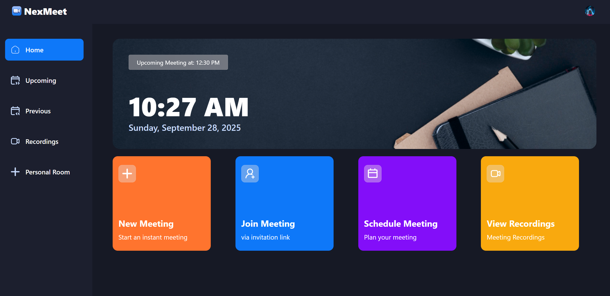
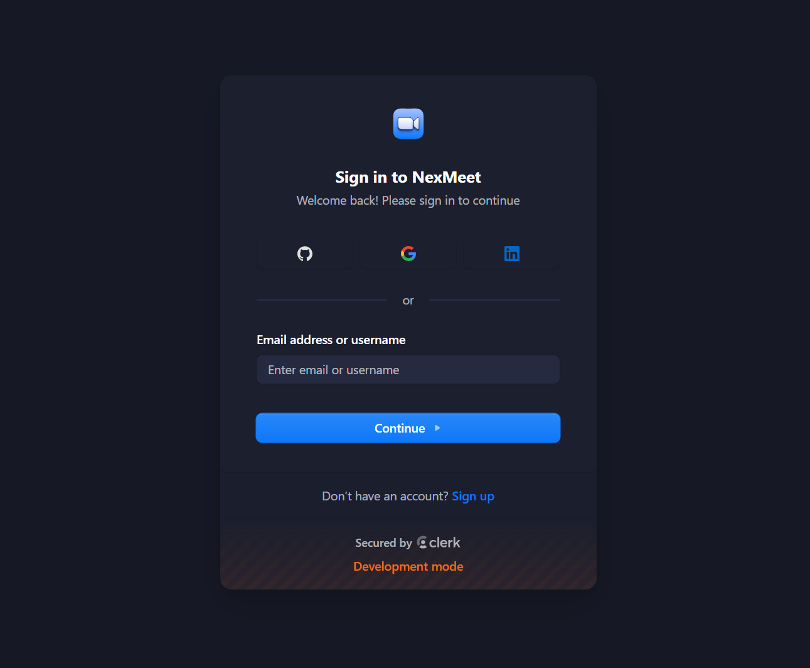
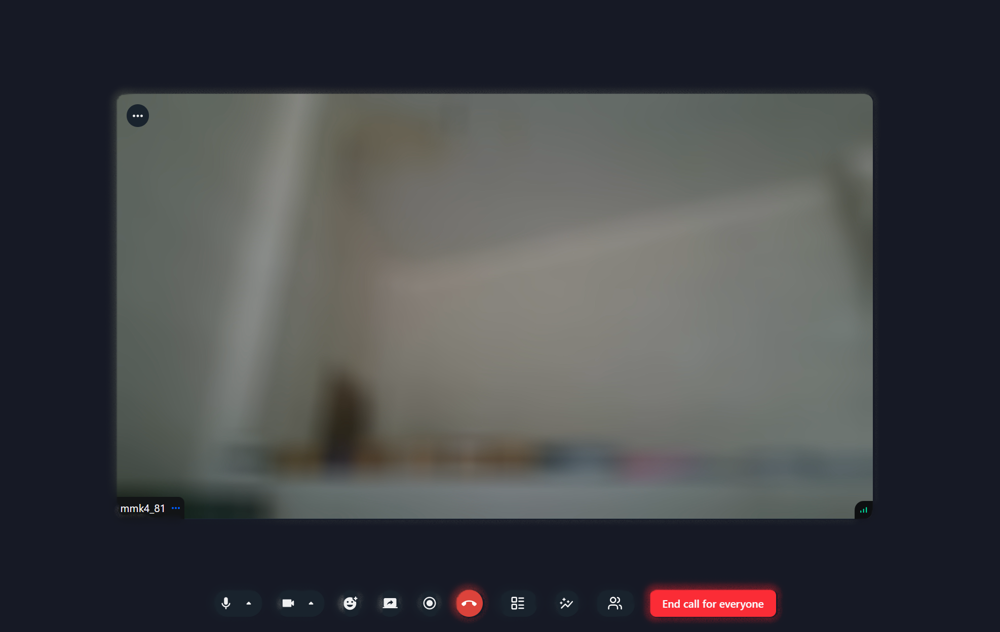

# NexMeet 🎥💬

NexMeet is a **Zoom clone** built with **Next.js** and **React**, designed for video and audio meetings. Users can create meetings, share links, join calls, and interact in real-time. The platform also supports **meeting history** and allows saving meetings for future reference.  

> This project was developed as a university assignment for learning real-time communication and frontend/backend integration.

---

## 🚀 Features

- Create and join **video & audio meetings**
- Share meeting links with participants
- **Real-time communication** between users
- View **meeting history**
- Save meetings for future access
- Authentication with **Clerk** for secure login
- Responsive UI for both desktop and mobile

---

## 🛠️ Key Technologies

- **Next.js 15** - Server-side rendering & React framework  
- **React 19** - Frontend library for UI components  
- **Tailwind CSS** - Styling & responsive design  
- **Clerk** - Authentication & user management  
- **Stream Video SDK** - Real-time video & audio calls  
- **Radix UI** - Accessible and composable UI components  

---

## 📸 Screenshots

### Home Page


### Authentication Page (Clerk)


### Meeting Page


---

## ⚙️ Installation & Setup

Follow these steps to run NexMeet locally:

### 1. Clone the repository
```bash
git clone https://github.com/mmk4-81/zoom_clone.git
cd zoom_clone

2. Install dependencies
npm install

3. Run the development server
npm run dev
